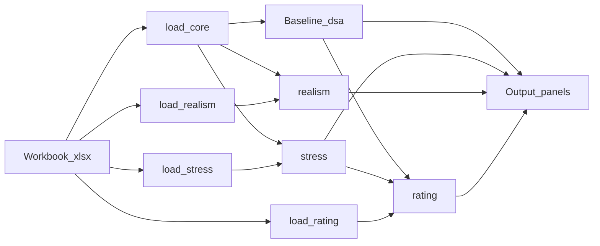

One-page lookup from familiar LIC-DSF sheets to `lic_dsf` load packages and demos.

**Edit inputs in Excel**, save, then reload with the functions below.

## Pipeline

## Load packages

| Function | Excel sheets |
|----------|--------------|
| `load_core` | Input 4/5, Ext, Macro → books + baseline DSA |
| `load_domestic` | Dom debt |
| `load_stress` | Input 6, Input 7, tailored tests |
| `load_rating` | CI Summary, Trigger, Input 1 market |
| `load_realism` | Imported data, Realism 1–4 |
| `load_probability` | Probability / Output 6 covariates |

## Sheet map

| Excel | Load / type | Demo |
|-------|-------------|------|
| Input 4 / 5, Ext, Macro | `load_core` → `macro`, `external`, baselines | [`baseline_dsa`](https://github.com/Teal-Insights/py-lic-dsf/blob/main/demo/baseline_dsa.ipynb) |
| New MLT portfolio (after load) | `external.portfolio` | [`ext_debt`](https://github.com/Teal-Insights/py-lic-dsf/blob/main/demo/ext_debt.ipynb) |
| `Dom_Debt_Data` / indicators | `load_domestic` → `DomesticDebtBook` | [`dom_debt`](https://github.com/Teal-Insights/py-lic-dsf/blob/main/demo/dom_debt.ipynb) |
| Baseline – external / public | from `load_core` | [`baseline_dsa`](https://github.com/Teal-Insights/py-lic-dsf/blob/main/demo/baseline_dsa.ipynb) |
| Output 1-1 / 1-2 | `external_dsa_panel`, `public_dsa_panel` | [`baseline_dsa`](https://github.com/Teal-Insights/py-lic-dsf/blob/main/demo/baseline_dsa.ipynb) |
| Input 6 / 7 / tailored | `load_stress` | [`stress_dsa`](https://github.com/Teal-Insights/py-lic-dsf/blob/main/demo/stress_dsa.ipynb) |
| Output 2 / 3 | `stress_external_panel`, `stress_public_panel` | [`stress_dsa`](https://github.com/Teal-Insights/py-lic-dsf/blob/main/demo/stress_dsa.ipynb) |
| Realism 1–4 / Output 4 | `load_realism` + `lic_dsf.realism` / `output` | [`realism`](https://github.com/Teal-Insights/py-lic-dsf/blob/main/demo/realism.ipynb) |
| CI / Trigger / Input 1 market | `load_rating` | [`risk_rating`](https://github.com/Teal-Insights/py-lic-dsf/blob/main/demo/risk_rating.ipynb) |
| Chart Data / Output 5 / 7 | `ChartDataRegistry`, `risk_summary_panel` | [`output_7`](https://github.com/Teal-Insights/py-lic-dsf/blob/main/demo/output_7.ipynb), [`risk_rating`](https://github.com/Teal-Insights/py-lic-dsf/blob/main/demo/risk_rating.ipynb) |
| Probability / Output 6 | `load_probability`, `probability_panel` | [`output_6`](https://github.com/Teal-Insights/py-lic-dsf/blob/main/demo/output_6.ipynb) |
| Full Outputs tour | all of the above | [`all_outputs`](https://github.com/Teal-Insights/py-lic-dsf/blob/main/demo/all_outputs.ipynb) |

## Package roles (one line each)

| Package | Owns | Does not own |
|---------|------|--------------|
| `lic_dsf.load` | Six economist load packages (+ internal parsers) | Ratio math, shocks, Output frames |
| `lic_dsf.pv` | Instruments, portfolios, LC-NR, NPV helpers | Ext/Dom/Macro books, ResFin, ratings |
| `lic_dsf.books` | Ext / Dom / Macro debt books | Instrument templates, ResFin fill, Output frames |
| `lic_dsf.resfin` | Input 7 params, ResFin overlays, split policies, fixed-point engine | Macro shocks, baseline books, Output frames |
| `lic_dsf.dsa` | Baseline external/public sustainability ratios | Stress shocks, CI thresholds, Output DataFrames |
| `lic_dsf.output` | Output-sheet panels and Excel-geometry tables | Ratio math, shocks, ratings |
| `lic_dsf.stress` | Input 6 shocks, runners, stressed ratios (calls `resfin`) | Baseline-only math, ResFin implementation, final rating |
| `lic_dsf.realism` | Realism 1–4 math | Chart Data, risk ratings, Output 4 frames |
| `lic_dsf.rating` | CI thresholds, breaches, mechanical ratings | DSA ratio numerators, Output DataFrame chrome |
| `lic_dsf.scenario` | Customized paths and probability math | Input 8 SDR (via Ext books); Output 6 frames |

---

**Next:** [2. Getting started](getting-started.qmd)
